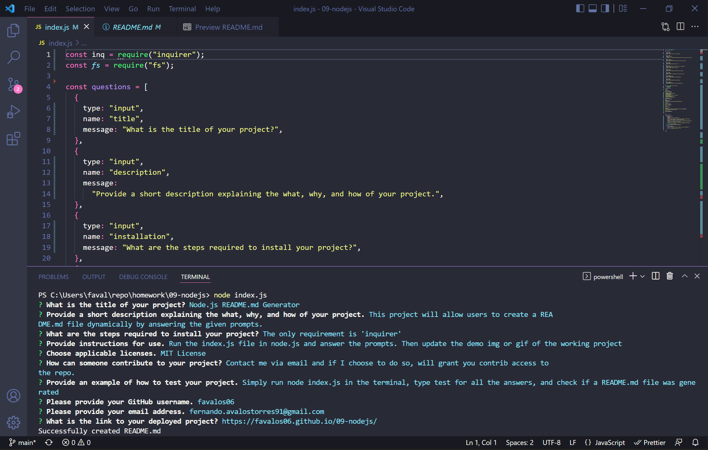

# Node.js README.md Generator

## Description
This project will allow users to create a README.md file dynamically by answering the given prompts.

## Tablet of Contents
- [Installation](#installation)
- [Usage](#usage)
- [License](#license)
- [How to Contribute](#how-to-contribute)
- [Tests](#tests)
- [Questions](#questions)
- [Deployed Link](#deployed-link)

## Installation
The only requirement is to install 'inquirer'

## Usage
Run the index.js file in node.js and answer the prompts. Then update the demo img or gif of the working project

## License
ISC

## How to Contribute
Contact me via email and if I choose to do so, will grant you contrib access to the repo.

## Tests
Simply run node index.js in the terminal, type test for all the answers, and check if a README.md file was generated

## Questions
* Follow me on [GitHub](https://github.com/favalos06)
* Ask me question at fernando.avalostorres91@gmail.com

## Deployed Link
https://favalos06.github.io/09-nodejs/
  